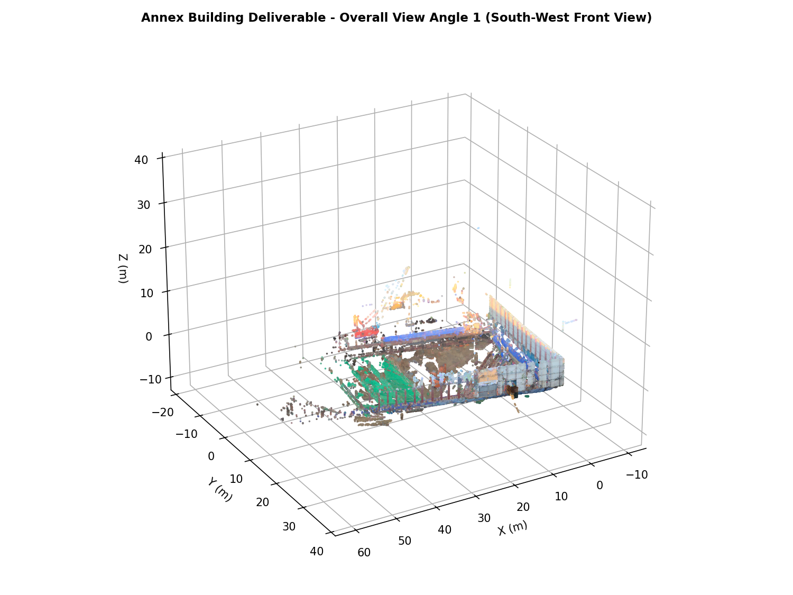
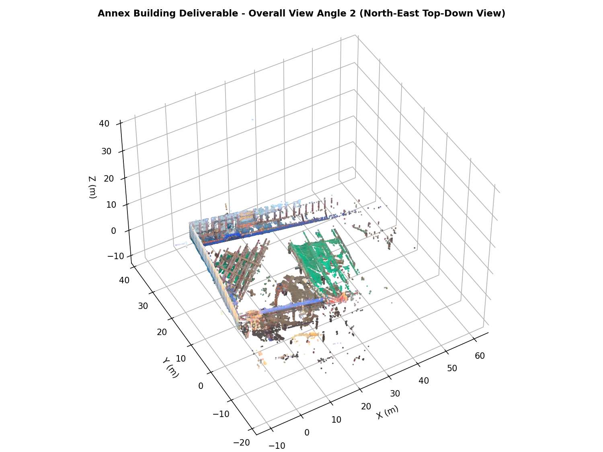
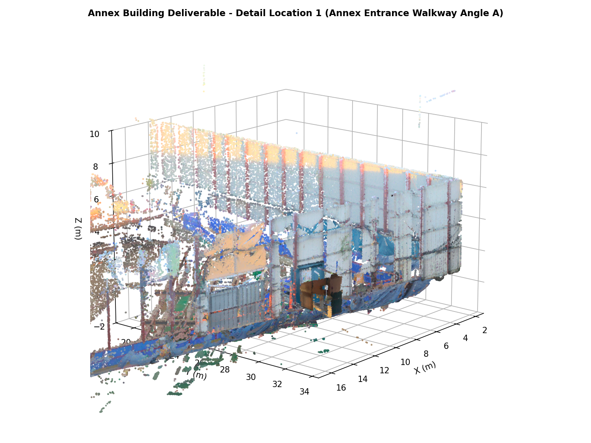
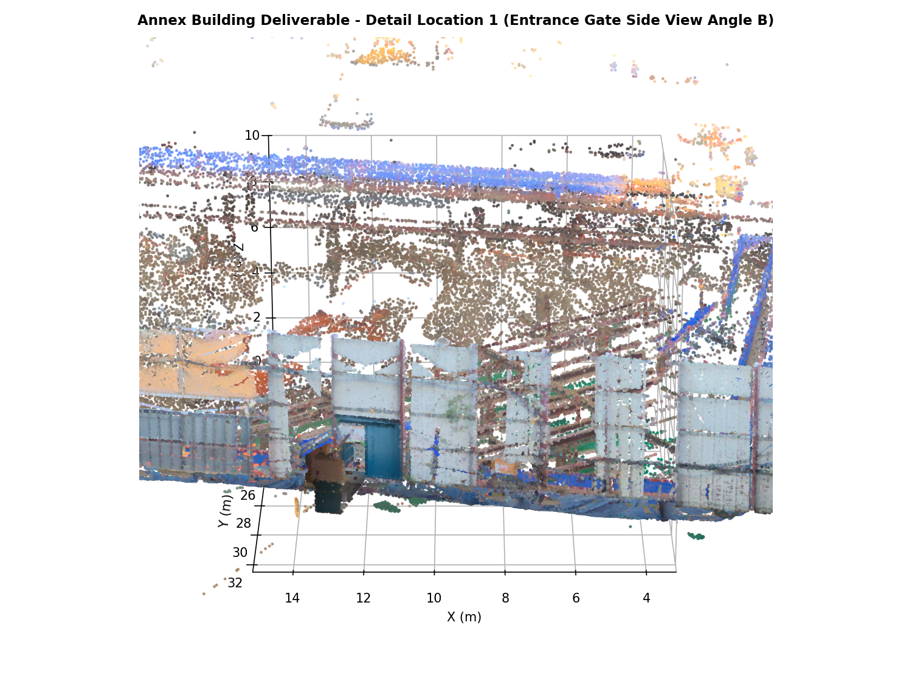
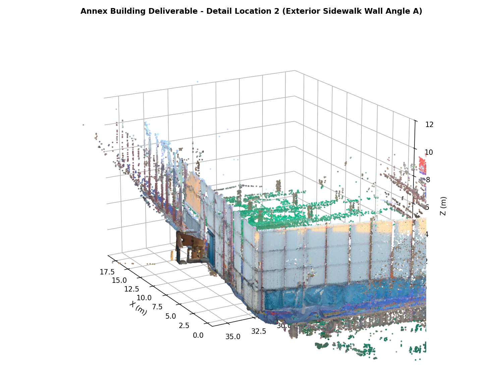
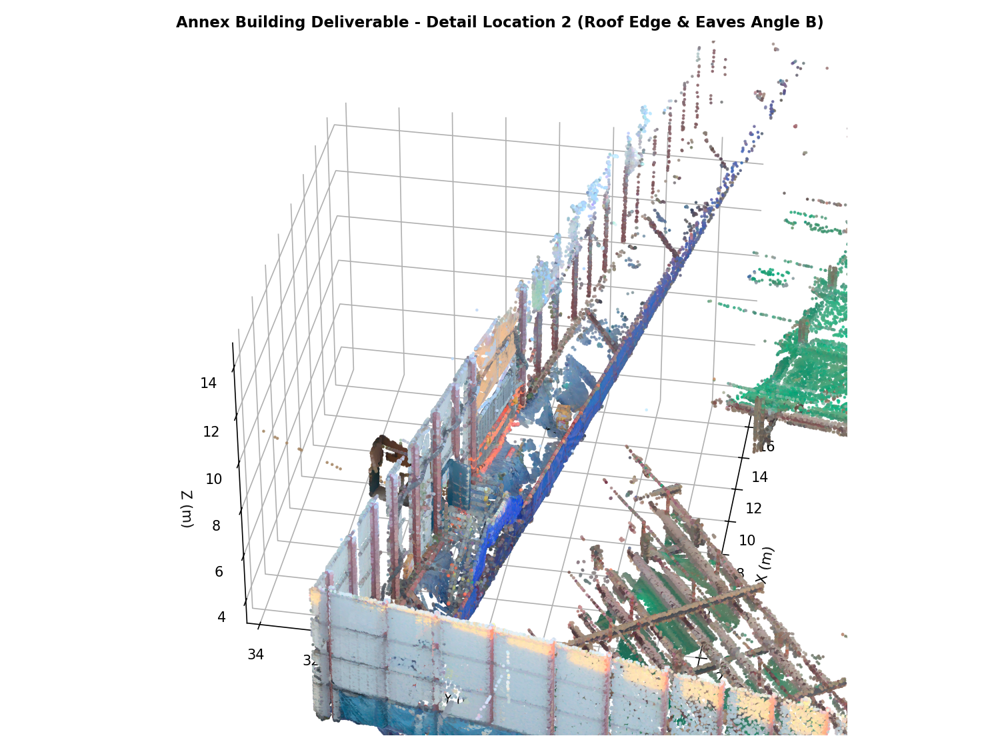

# 별동 (S017~S019) 성과품 안내

- **스캔 수**: 3개 (`Setup 017` ~ `Setup 019`)
- **점 수**: 1,185만 점
- **범위**: 기숙사 별동 건물 (부지 반대편, y≈30 구역)
- **상대 정합 오차**: 최근접 거리 중앙값 **7.0 cm** (5cm 이내 36.6%)

---

## 📸 최종 성과물 시각화 (6개 관측 시점)

별동 3D LiDAR 점군 및 정합·메시 성과물의 시각적 검증을 위해 전체 전경 2개 각도 및 세부 관측 위치 2개소(각 2개 각도)의 고해상도 성과 이미지를 첨부합니다.

### 1. 전체 전경 (Overall Views - 2개 각도)
| 전경 각도 1 (남서측 전경 조감) | 전경 각도 2 (북동측 상부 조감) |
| :---: | :---: |
|  |  |
| *<그림 1-1: 별동 전체 3D 점군 정합 성과 남서측 조감뷰>* | *<그림 1-2: 별동 전체 3D 점군 정합 성과 북동측 조감뷰>* |

### 2. 세부 위치 1: 별동 진입로 및 보도 블록 (Annex Walkway Entrance)
| 세부 위치 1 - 각도 A (진입 보도 정면) | 세부 위치 1 - 각도 B (진입 게이트 측면) |
| :---: | :---: |
|  |  |
| *<그림 2-1: 별동 진입로 및 보도 블록 정면 정밀 점군뷰>* | *<그림 2-2: 별동 진입 게이트 우측 보도 측면뷰>* |

### 3. 세부 위치 2: 별동 외벽 모퉁이 및 지붕 처마 (Corner Wall & Eaves)
| 세부 위치 2 - 각도 A (보도 모퉁이 외벽) | 세부 위치 2 - 각도 B (지붕 처마 상부) |
| :---: | :---: |
|  |  |
| *<그림 3-1: 별동 외벽 모퉁이 구조체 입면뷰>* | *<그림 3-2: 별동 지붕 처마 및 상부 파사드 근접뷰>* |

---

## 📁 파일 목록

### `01_점군/`
- `Registered_Dorm_annex.ply` / `.e57`: 3개 스캔 정합 완료 원해상도 점군 (1,185만 점)
- `Registered_Dorm_annex_preview.ply`: 2cm 복셀 미리보기
- `poses_annex.json`: 스캔별 변환 행렬 (센서 원점 3개)

### `02_메시/`
- `Mesh_annex_poisson.ply`: Screened Poisson 메시 (**권장**, 1,090만 면, 215MB)
- `Mesh_annex_2cm.ply`: 마칭 큐브 2cm 메시 (979만 면, 198MB)
- `Mesh_annex.ply`: 마칭 큐브 5cm 메시 (224만 면, 45MB)
