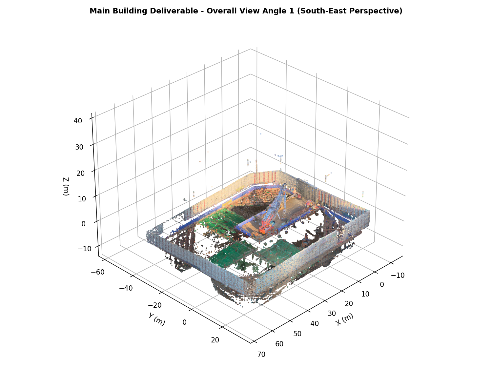
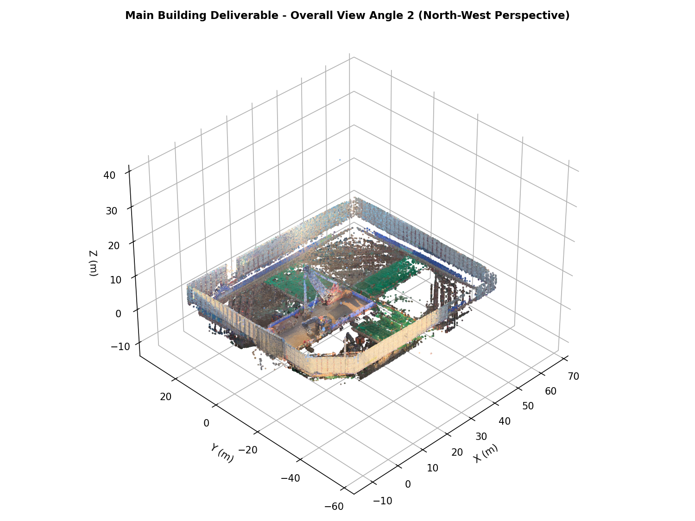
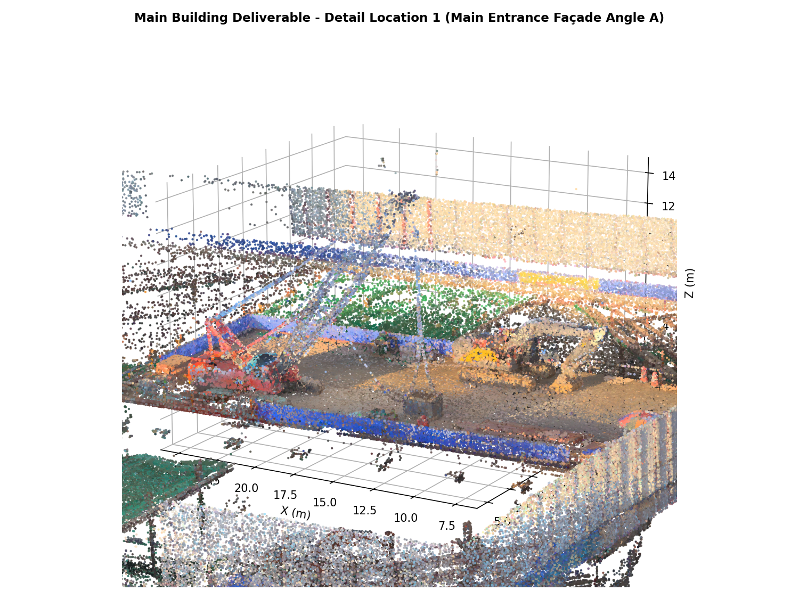
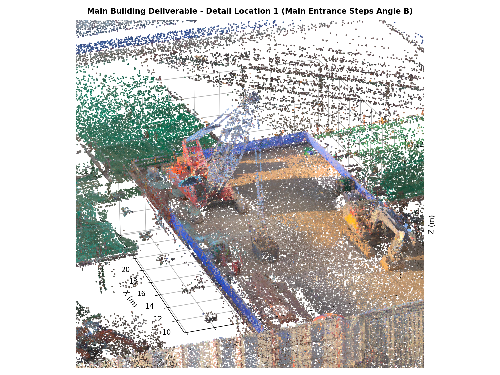
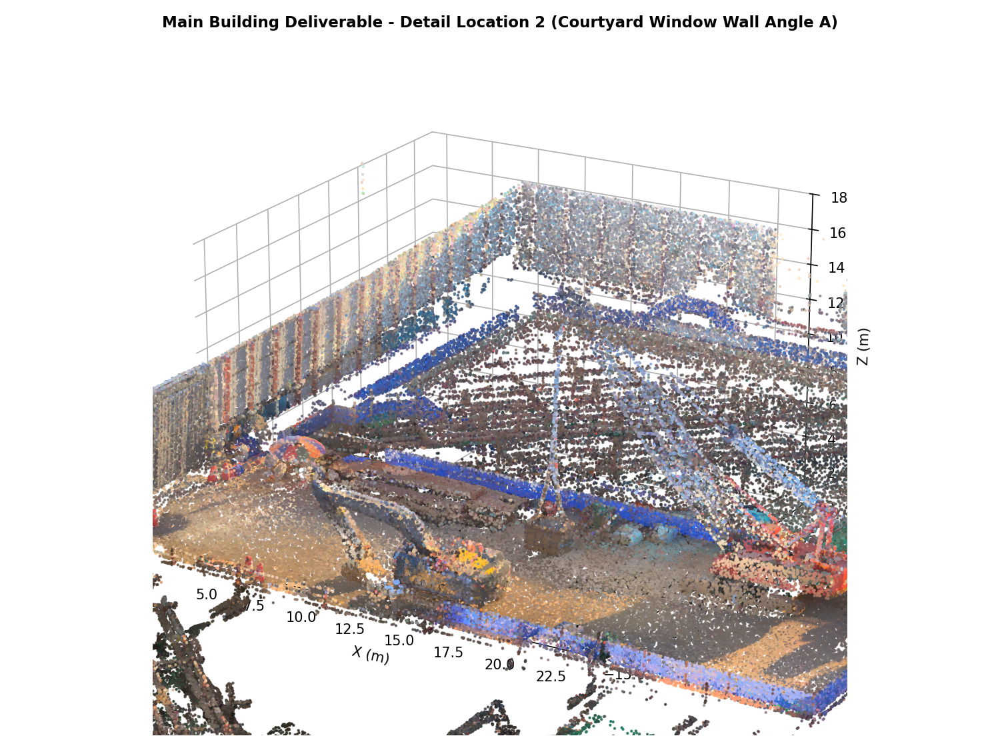
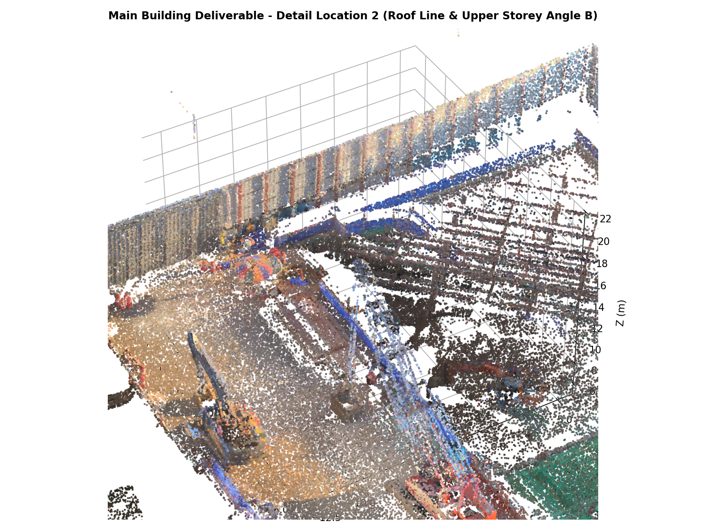

# 본체 (S003~S016) 성과품 안내

- **스캔 수**: 14개 (`Setup 003` ~ `Setup 016`)
- **점 수**: 3,792만 점
- **범위**: 기숙사 본체 건물 및 주변 부지 주요부
- **상대 정합 오차**: 최근접 거리 중앙값 **2.6 cm** (5cm 이내 86.3%)

---

## 📸 최종 성과물 시각화 (6개 관측 시점)

본체 3D LiDAR 점군 및 정합·메시 성과물의 시각적 검증을 위해 전체 전경 2개 각도 및 세부 관측 위치 2개소(각 2개 각도)의 고해상도 성과 이미지를 첨부합니다.

### 1. 전체 전경 (Overall Views - 2개 각도)
| 전경 각도 1 (남동측 조감) | 전경 각도 2 (북서측 측면 조감) |
| :---: | :---: |
|  |  |
| *<그림 1-1: 본체 전체 3D 점군 정합 성과 남동측 조감뷰>* | *<그림 1-2: 본체 전체 3D 점군 정합 성과 북서측 조감뷰>* |

### 2. 세부 위치 1: 본체 주출입구 및 진입로 (Main Entrance Façade)
| 세부 위치 1 - 각도 A (주출입구 정면) | 세부 위치 1 - 각도 B (주출입구 계단 측면) |
| :---: | :---: |
|  |  |
| *<그림 2-1: 주출입구 및 접근 진입로 정면 정밀 점군뷰>* | *<그림 2-2: 주출입구 기둥 및 진입 계단 근접 측면뷰>* |

### 3. 세부 위치 2: 중정 창호 파사드 및 지붕 구조 (Courtyard & Roof)
| 세부 위치 2 - 각도 A (중정 창호 벽면) | 세부 위치 2 - 각도 B (상부 지붕 라인) |
| :---: | :---: |
|  |  |
| *<그림 3-1: 중정 내벽 및 창호 구조체 입면뷰>* | *<그림 3-2: 상부 층 구조 및 지붕 처마 정밀 점군뷰>* |

---

## 📁 파일 목록

### `01_점군/`
- `Registered_Dorm_main.ply` / `.e57`: 14개 스캔 정합 완료 원해상도 점군 (3,792만 점)
- `Registered_Dorm_main_preview.ply`: 2cm 복셀 미리보기 (빠른 훑어보기용)
- `poses_main.json`: 스캔별 변환 행렬 (센서 원점 14개)

### `02_메시/`
- `Mesh_main_poisson.ply`: Screened Poisson 메시 (**권장**, 5,139만 면, 1,011MB)
- `Mesh_main_2cm.ply`: 마칭 큐브 2cm 메시 (6,874만 면, 1,370MB)
- `Mesh_main.ply`: 마칭 큐브 5cm 메시 (1,185만 면, 237MB)
