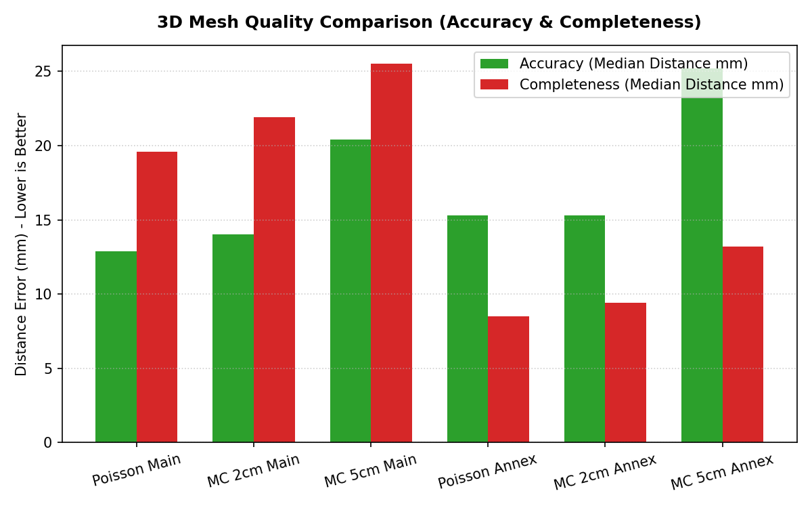

# 3D 메시 생성 보고서

- **입력**: `02_성과품/`의 정합 완료 점군 (본체 3,792만 점 / 별동 1,185만 점)
- **출력**: 그룹별 Screened Poisson 판 + 마칭 큐브 2cm/5cm 판
- **스크립트**: `04_처리스크립트/make_mesh_poisson.py` (권장), `make_mesh.py` (마칭 큐브), `compare_mesh.py` (비교)
- **작업일**: 2026-08-01 ~ 08-02

---

## 1. 결과물 요약


*<그림 1-1: Screened Poisson vs Marching Cubes (2cm/5cm) 정확도 및 완전성 비교 그래프>*


두 방식으로 만들었다. **Screened Poisson 판을 권장한다.**

| 메시 | 면 | 평균 모서리 | 크기 | 소요시간 |
|---|---|---|---|---|
| **본체 Poisson** `Mesh_main_poisson.ply` | 5,139만 | 16.2 mm | 1,011 MB | 33분 |
| 본체 마칭큐브 2cm `Mesh_main_2cm.ply` | 6,874만 | 19.1 mm | 1,370 MB | 2시간 00분 |
| 본체 마칭큐브 5cm `Mesh_main.ply` | 1,185만 | 48.0 mm | 237 MB | 2시간 21분 |
| **별동 Poisson** `Mesh_annex_poisson.ply` | 1,090만 | 13.5 mm | 215 MB | 7분 |
| 별동 마칭큐브 2cm `Mesh_annex_2cm.ply` | 979만 | 19.5 mm | 198 MB | 17분 |
| 별동 마칭큐브 5cm `Mesh_annex.ply` | 224만 | 48.6 mm | 45 MB | 19분 |
| 별동 마칭큐브 10cm `Mesh_annex_10cm.ply` | 65만 | 97.0 mm | 13 MB | 3분 |

전 메시 공통: 정점 색(RGB) 보존, 점군과 동일 좌표계.

### 방식 비교 (실측)

**정확도** = 메시 표면에서 실측 점까지 거리 (지어낸 표면이 많으면 커진다)
**완전성** = 실측 점에서 메시 표면까지 거리 (구멍이 많으면 커진다)

본체

| 메시 | 정확도(중앙/95%) | 완전성(중앙/95%) | 바깥향 | 감김 |
|---|---|---|---|---|
| **Poisson** | **12.9** / 36mm | **19.6** / **42mm** | **88.3%** | **True** |
| 마칭큐브 2cm | 14.0 / **31mm** | 21.9 / 44mm | 77.0% | False |
| 마칭큐브 5cm | 20.4 / 71mm | 25.5 / 50mm | 79.1% | True |

별동

| 메시 | 정확도(중앙/95%) | 완전성(중앙/95%) | 바깥향 | 감김 |
|---|---|---|---|---|
| **Poisson** | 15.3 / 38mm | **8.5 / 22mm** | **83.0%** | **True** |
| 마칭큐브 2cm | 15.3 / **32mm** | 9.4 / 19mm | 78.5% | False |
| 마칭큐브 5cm | 25.2 / 74mm | 13.2 / 31mm | 77.3% | False |

**Poisson이 대부분의 지표에서 앞선다.** 본체 기준 삼각형을 25% 적게 쓰고도
(5,139만 vs 6,874만) 더 정확하다. 옥트리 적응형이라 평평한 곳에 삼각형을
낭비하지 않기 때문이다. 위상 품질(감김 일관성, 법선 방향)도 낫고 6배 빠르다.
마칭 큐브가 앞서는 건 정확도 95% 하나뿐이다.

### 어느 것을 쓸 것인가

| 용도 | 권장 |
|---|---|
| 일반적인 용도, 정밀 검토, 단면 추출 | **Poisson 판** |
| 전체 조망, 공유, 뷰어에서 회전/이동 | 마칭큐브 5cm 판 |
| 저사양 환경 미리보기 | 별동 10cm 판 |

본체 Poisson은 1GB가 넘어 뷰어에 부담이 된다. 전체를 돌려보는 작업엔 5cm를,
특정 부위를 자세히 볼 때 Poisson을 권한다.

### 표면적이 방식·해상도마다 다른 이유

같은 구역인데 별동 기준 10cm 2,271 m² → 5cm 1,960 m² → 2cm 1,370 m² →
Poisson 1,082 m² 로 줄어든다. 면적이 실제로 준 게 아니라, **데이터 근거가
약한 외삽 표면이 더 정확히 잘려나가기 때문**이다. 거친 격자일수록 측정되지
않은 영역까지 표면을 만들어 면적이 부풀려진다. 계측에 쓸 때 오해하기 쉽다.

## 2. 해상도를 무엇이 결정하는가

### 점군은 sparse하지 않다

SfM/사진측량에서는 특징점만 삼각측량한 sparse 결과를 MVS로 densify한다.
**LiDAR에는 그 단계가 없다.** 모든 점이 직접 측정한 거리값이라 처음부터
dense하고, 없는 측정을 만들어낼 방법도 없다.

실측한 원해상도 점간격 (스캔 밀집 구역 5m 큐브, 다운샘플 없이):

| | 최근접점 거리 중앙값 | 5cm 복셀 후 유지율 | 2cm 복셀 후 유지율 |
|---|---|---|---|
| 별동 | **2.08 mm** | 1.0% | 4.7% |
| 본체 | **5.60 mm** | 4.1% | 22.6% |

즉 초기 5cm 메시가 엉성했던 것은 데이터 한계가 아니라 **다운샘플 설정 탓**이며,
점의 95~99%를 버리고 있었다.

### 진짜 상한은 정합 정확도다

점간격은 2~6mm지만, **정합 정확도는 본체 2.6cm / 별동 7.0cm**다
(다른 스캔까지 최근접 거리 중앙값, `작업보고서.md` §1).

같은 벽을 찍은 서로 다른 스캔의 점들이 이미 그만큼 어긋나 있다는 뜻이다.
격자를 그보다 잘게 하면 정밀해지는 게 아니라 **정합 오차가 표면의 요철로
그대로 조각된다.** 거친 격자의 복셀 평균이 그 오차를 가려주고 있었을 뿐이다.

**따라서 2cm가 이 데이터의 실질적 상한이다.** 그 이하는 측정 정보가 아니라
정합 오차를 렌더링하는 일이 된다. 더 정밀한 메시가 필요하다면 해상도를 높일
게 아니라 **정합을 개선하거나 재촬영해야 한다.**

### 그래도 더 잘게 하려면 (참고)

본체 기준 추정. 현재 장비는 RAM 64GB / 12코어.

| 격자 | 면 수 | 파일 크기 | 필요 RAM | 소요시간 |
|---|---|---|---|---|
| 5cm | 1,185만 | 237 MB | 약 11 GB | 2시간 21분 (실측) |
| 2cm | 6,874만 | 1,370 MB | 약 30 GB | 2시간 00분 (실측) |
| 1cm | 약 3억 | 약 6 GB | **128 GB 이상** | 약 8시간 |
| 5mm | 약 12억 | 약 24 GB | **512 GB 이상** | 수일 |

1cm 이하는 일반 뷰어에서 열리지 않고, 위 이유로 품질도 나아지지 않는다.

---

## 3. 처리 방식

두 방식을 모두 구현했다.

### (A) Screened Poisson — 권장, `make_mesh_poisson.py`

점을 '지시함수'로 보고 전역 푸아송 방정식을 풀어 표면을 만든다. 국소 잡음에
강하고 표면이 매끄러우며, 옥트리라 곡률이 큰 곳에 자동으로 삼각형을 더 쓴다.
해상도는 `--depth`(옥트리 깊이)로 정한다.

```
정합 완료 E57 (스캔 블록 유지)
 └ 스캔별로 읽고 센서 원점(poses_*.json)으로 법선 방향 정렬
 └ 법선 포함 PLY 로 임시 저장
 └ pymeshlab: generate_surface_reconstruction_screened_poisson
 └ 실측점에서 support(5cm) 초과 표면 제거   ← 밀도 백분위 아님, §4-(5)
 └ 중복/영면적 면 제거 → 부유 조각 제거 → 정점 색 입힘 → PLY
```

**처음에는 이 방식을 쓸 수 없다고 판단했는데 그게 틀렸다.** Open3D 가 Python
3.13 용 배포판이 없다는 이유로 Poisson 자체를 포기했으나, 구현체는 여럿이다.
`pymeshlab`(MeshLab 의 Python 바인딩) 2025.7 이 Python 3.13 에 설치되고
Screened Poisson·볼 피벗팅·MLS 마칭큐브를 모두 제공한다.

참고로 이 PC 에 **COLMAP 은 설치돼 있지 않다.** 있었다면 `colmap
poisson_mesher` 로도 같은 알고리즘을 쓸 수 있었다(이미지 없이 점군 PLY 만으로
동작하는 독립 명령이다). **CloudCompare 2.13.2** 에는 PoissonRecon 플러그인이
있으나 명령줄에 노출되지 않아 GUI 로만 쓸 수 있다.

### (B) SDF + 마칭 큐브 — `make_mesh.py`

부피 방식이라 3차원 격자 위에 스칼라 값을 샘플링한 뒤 등치면을 뽑는다.
**격자 간격이 곧 메시 해상도**이며, 다운샘플이 선택 사항으로 붙은 게 아니라
방법 자체의 일부다.

```
정합 완료 E57 (스캔 블록 유지)
 └ 스캔별로 읽고 센서 원점으로 법선 방향 정렬
 └ 격자 해상도로 복셀 다운샘플
 └ 고립 노이즈 제거 (반경 0.3m 내 이웃 8개 미만)
 └ 점이 있는 블록만 순회
      · 이웃 블록까지 모아 지역 KD 트리
      · sdf = dot(복셀중심 − 최근접점, 그 점의 법선), 크기만 절단
      · 마칭 큐브 → 블록 안에서 즉시 support 트리밍
 └ 정점 병합 → 퇴화/중복 면 제거 → 부유 조각 제거
 └ 연결 조각 단위 법선 방향 정렬 → 정점 색 입힘 → PLY
```

### 법선 방향에 스캔 블록이 필요한 이유

재구성 품질은 법선의 안/밖 부호가 좌우하는데, 병합된 좌표만으로는 그 점을
어느 위치에서 봤는지 알 수 없다. 성과품 E57이 **스캔 블록을 유지**하고
`poses_*.json`에 센서 원점이 있어, 스캔별로 법선을 센서 쪽(빈 공간)으로
정렬해 올바른 부호를 얻었다. 정합 단계에서 블록 구조를 남겨둔 것이 여기서 쓰였다.

---

## 4. 해결한 문제

작업 중 세 번 잘못된 메시가 나왔고, 고해상도에서는 성능 문제가 별도로 있었다.

### (1) 이중 껍질

처음에는 최근접점이 절단거리보다 멀면 "바깥(+)"으로 채웠다. 그러면 벽 안쪽
깊은 곳까지 바깥이 되어 **실제 표면 뒤 절단거리 지점에 가짜 표면이 하나 더**
생긴다. 법선 방향을 재보니 정확히 반반(49.3%)으로 갈려 있었다.

→ 부호는 거리 제한 없이 최근접점 법선으로 정하고(단일 표면), 데이터가 없어
외삽된 부분은 `support` 거리로 잘라낸다. Poisson의 density trimming과 같은 역할.

### (2) 법선 역방향

skimage `marching_cubes`의 `gradient_direction` 의미를 문서만 보고 판단했다가
반대로 나왔다 (바깥향 24.2%).

→ 라이브러리 규약에 의존하지 말고 센서 위치로 실측해 뒤집도록 바꿨다.

### (3) 조각별 방향 불일치

전체를 일괄로 뒤집어도 75%에 머물렀다. 연결 조각마다 방향이 제각각이었다.

→ 연결 조각 단위 다수결 뒤집기로 변경. 별동 5cm 기준 165개 조각 중 162개를
뒤집어 22.9% → 77.1%.

### (4) 고해상도 성능 (2cm 대응)

5cm용 구현으로는 2cm를 감당할 수 없어 두 군데를 고쳤다.

**전체 격자 순회 → 점이 있는 블록만 순회.**
이전에는 전체 격자를 훑으면서 블록마다 전체 점(수백만)을 스캔해 포함 여부를
봤다. 블록 수 × 점 수라 해상도를 높이면 폭발한다. 점을 블록 단위로 미리
담아두고 채워진 블록만 돈다. 표면은 부피가 아니라 면이라 채워진 블록 수는
훨씬 적다 — 본체 2cm에서 **22.22G 복셀 중 처리 대상은 8,593개 블록**뿐이다.

**사후 트리밍 → 블록 내 즉시 트리밍.**
SDF 부호가 블록 전체에 정의되므로 데이터에서 먼 곳까지 표면이 외삽되고,
그게 전부 메모리에 쌓였다 (별동 5cm: 원시 2,711만 면 → 트리밍 후 224만 면).
**12배를 들고 있다가 버리는 구조**라 2cm에서는 메모리가 버티지 못한다.
블록마다 만들자마자 걸러서 누적하도록 바꿨다.

결과적으로 **2cm(6,874만 면)가 5cm(1,185만 면)보다 오히려 빨라졌다**
(2시간 00분 vs 2시간 21분). 5cm 실행에는 감김 일관성 보정 40분이 포함돼
있었는데, 이 단계는 비용에 비해 눈에 보이는 차이가 거의 없어 기본에서 뺐다.

### (5) Poisson 의 밀도 트리밍이 LiDAR 에 맞지 않는다

Poisson 은 닫힌 표면을 만들려고 안 본 영역까지 지어내므로 잘라내야 한다.
표준적인 방법은 재구성이 내놓는 정점 밀도(quality) 하위 N% 를 제거하는 것인데,
**LiDAR 에 그대로 쓰면 안 된다.** 원거리일수록 점밀도가 낮아 '멀지만 실제로
측정된 면'이 저밀도로 분류돼 함께 잘려나간다.

별동 실측 (`02_성과품/별동_S017-S019/02_메시/비교실험/`):

| 트리밍 | 정확도 중앙 | 완전성 95% | 판정 |
|---|---|---|---|
| 밀도 하위 7% | 27.2mm | 25mm | 지어낸 면이 남음 |
| 밀도 하위 20% | **9.4mm** | **1,689mm** | 데이터 있는 곳에 1.7m 구멍 |
| 밀도 하위 35% | 10.0mm | 1,870mm | 더 심함 |
| **거리 5cm** | 15.3mm | **22mm** | **채택** |

밀도 20% 판은 정확도 중앙값이 제일 좋아 보이지만 완전성 95% 가 1.7m 다.
**중앙값만 보면 속는다.** 두 지표를 같이 봐야 한다.

→ 밀도가 아니라 **실측점까지의 거리**로 자른다. 마칭 큐브판과 같은 기준이며,
원거리 저밀도 면이 보존된다.

---

## 5. 한계

- **닫힌 솔리드가 아니다.** 스캔이 보지 못한 면(지붕 위, 가구 뒤)은 구멍으로
  남는 열린 표면이다. 데이터의 한계이지 처리의 문제가 아니다.
  부피 계산·불리언 연산·3D 프린팅에는 별도 구멍 메우기가 필요하다.
  시각화, 단면 추출, 면적·거리 계측에는 그대로 쓸 수 있다.
- **법선 바깥향 비율이 약 77%다.** 남는 부분은 가려진 면이라 "가장 가까운
  센서"라는 판정 기준 자체가 맞지 않는 경우가 대부분이다.
- **`is_winding_consistent`가 5cm 이하에서 False**다. 블록 이어붙임과 정점
  병합에서 비다양체(non-manifold) 모서리가 생긴다. 위상이 중요한 용도에는
  `--fix-winding` 옵션이 있으나 매우 느리다 (1,185만 면에 40분).
- **나무·풀 같은 비면상 물체는 덩어리로 뭉친다.** 마칭 큐브의 특성이다.
- **별동은 본체보다 품질이 낮다.** 스캔 3개뿐이라 상호 커버리지가 얇고,
  정합 정확도 자체가 7.0cm다. 해당 구역 추가 촬영이 확실한 개선책이다.

---

## 6. 재현 방법

```bash
cd 04_처리스크립트
PY="e:/Data/LiDAR/2026.01 403호 촬영/venv_lidar/Scripts/python.exe"

# Screened Poisson (권장)
"$PY" make_mesh_poisson.py --group main  --depth 13 --support 0.05   # 33분
"$PY" make_mesh_poisson.py --group annex --depth 13 --support 0.05   # 7분

# 마칭 큐브
"$PY" make_mesh.py --group main  --voxel 0.02 --suffix _2cm   # 2시간
"$PY" make_mesh.py --group main  --voxel 0.05                 # 약 30분
"$PY" make_mesh.py --group annex --voxel 0.02 --suffix _2cm   # 17분
"$PY" make_mesh.py --group annex --voxel 0.05                 # 약 5분

# 방식 비교 (성과품 폴더의 02_메시/ 기준 파일명)
"$PY" compare_mesh.py --group main --meshes Mesh_main_poisson.ply Mesh_main_2cm.ply
```

### make_mesh_poisson.py 옵션

| 옵션 | 기본값 | 설명 |
|---|---|---|
| `--depth` | 12 | 옥트리 깊이. 11~13 권장. 크면 세밀하고 무겁다 |
| `--support` | 0.05 | 실측점에서 이보다 먼 표면을 잘라냄 (m) |
| `--trim` | 0 (끔) | 밀도 백분위 트리밍. **LiDAR 에는 쓰지 말 것** (§4-5) |
| `--pointweight` | 4 | screening 강도. 0 이면 고전 Poisson |
| `--voxel` | 0.01 | 입력 다운샘플 (m). 0 이면 원해상도 전부 |
| `--min-component-faces` | 1000 | 이보다 작은 부유 조각 제거 |
| `--suffix` | 없음 | 출력 파일명 꼬리표 |

### make_mesh.py 옵션

| 옵션 | 기본값 | 설명 |
|---|---|---|
| `--voxel` | 0.05 | 격자 해상도 = 메시 해상도 (m) |
| `--support` | voxel×2 | 입력 점에서 이보다 먼 표면은 잘라냄 |
| `--trunc` | voxel×3 | SDF 절단거리 |
| `--block` | 64 | 블록 한 변의 복셀 수 |
| `--min-component-faces` | 500 | 이보다 작은 부유 조각 제거 |
| `--fix-winding` | 꺼짐 | 감김 일관성 보정 (매우 느림) |
| `--suffix` | 없음 | 출력 파일명 꼬리표 |

### 환경

- `pymeshlab`(Poisson), `scikit-image`(마칭 큐브)를 venv 에 설치해 두었다.
- **Open3D 는 Python 3.13 용 배포판이 없어 설치 불가**하다. 필요하면 Python
  3.12 이하로 별도 venv 를 만들어야 한다.
- 점군은 `02_성과품/*/01_점군/`, 메시 출력은 `02_성과품/*/02_메시/` 다.
