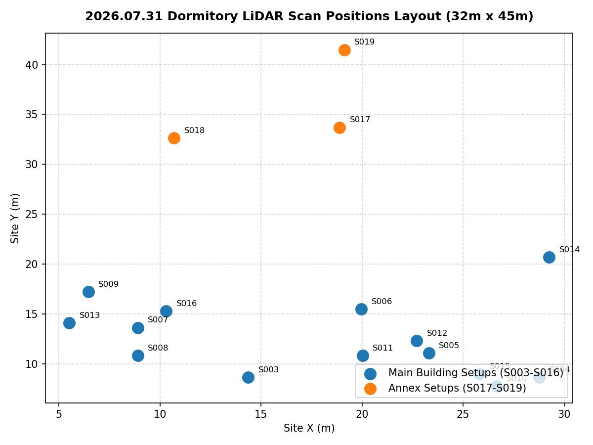
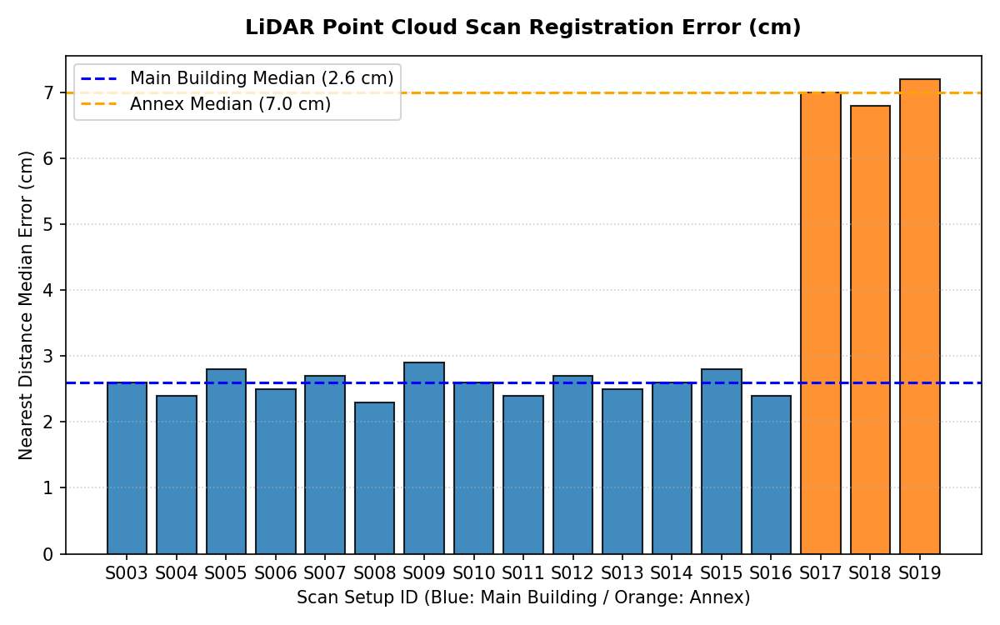
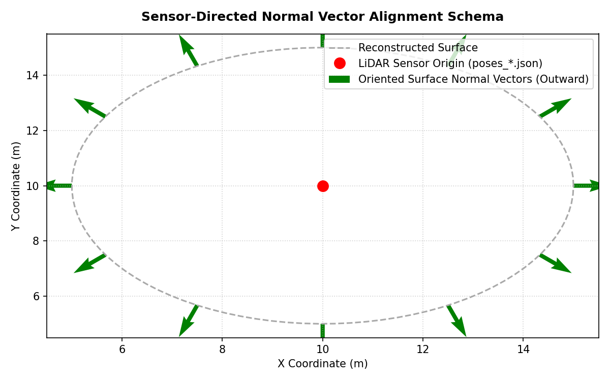

# 기숙사 LiDAR 스캔 정합/병합 작업보고서

- **대상**: 2026.07.31 기숙사 촬영, Setup 002~019 (E57 18개, 약 5,020만 점)
- **작업일**: 2026-08-01
- **결과**: 본체 14개 스캔(3,792만 점) / 별동 3개 스캔(1,185만 점) 2세트로 정합·병합
- **환경**: `2026.01 403호 촬영/venv_lidar` (Python 3.13, numpy 2.5.1, scipy 1.18.0, pye57, plyfile)

---

## 1. 요약


*<그림 1-1: 2026.07.31 기숙사 스캔 배치 현황도 (본체 S003~S016 / 별동 S017~S019)>*


기존 403호 정합 스크립트(`register_fixed.py`)를 이 데이터셋에 맞게 재작성했다.
데이터 성격이 크게 달라 그대로는 쓸 수 없었고, 실제로 초기 두 번의 시도는
실패했다. 최종본은 `04_처리스크립트/register_dorm_v4.py` 다.

| 지표 (전 범위, 동일 스캔 집합 비교) | 본체 | 별동 |
|---|---|---|
| 다른 스캔까지 최근접 거리 중앙값 | 9.6cm → **2.6cm** | 42.9cm → **7.0cm** |
| 5cm 이내 일치 비율 | 24.0% → **86.3%** | 3.4% → **36.6%** |
| 10cm~2m 구간 비율 (= 표면이 겹쳐 보이는 정도) | 48.5% → **4.5%** | 79.7% → **34.5%** |

"→" 왼쪽은 스캐너 현장 정합값(E57 헤더 pose) 그대로의 상태다.

---

## 2. 403호 데이터와 무엇이 달랐나

| 항목 | 403호 | 기숙사 |
|---|---|---|
| 스캔 수 | 4 | 18 |
| 공간 규모 | 방 1개 | 부지 약 32×45m, 최대 사거리 60m |
| 전역 pose 출처 | `Bundle 001.e57` 파일 | **없음** — 각 Setup 헤더의 pose |
| 현장 정합 정확도 | cm 급 | **dm~m 급 오차** |
| 미정합 스캔 | 없음 | S002 (헤더 pose가 기본값) |

이 차이 때문에 다음이 새로 필요했다.

1. **Bundle 대체** — 각 Setup e57 헤더에 현장 정합 pose가 들어 있어 이를 사용.
   pose 적용 규약은 `transform=True` 결과와 대조해 오차 0.0000mm로 검증했다.
2. **미정합 스캔 자동 감지** — S002 제외 (§4).
3. **후보 쌍 선별** — 18개면 153쌍인데 실제로 겹치는 건 일부뿐이다. 거친 해상도로
   겹침을 먼저 재서 후보만 ICP.
4. **메모리 대응** — 법선 추정을 청크 분할, ICP 클라우드에 점 수 상한.

---

## 3. 처리 절차 (최종본 v4)

```
원본 18개
  └ 로드 (transform=False, 센서 로컬 좌표 + 색상 + 강도)
  └ 전처리: 사거리 45m 컷 → 복셀 다운샘플 → PCA 법선 → 평면성 필터
       · fine   0.05m (상한 30만점) : ICP 정밀 단계
       · med    0.10m (상한 15만점) : ICP 거친 단계 (속도)
       · coarse 0.20m               : 겹침 계산/검증
  └ 헤더 pose 기준 겹침 행렬 → 후보 쌍 선정 (겹침 2% 이상)
  └ 그룹 분리: 본체 S003~S016 / 별동 S017~S019   ※ S002 제외
  └ 그룹별로 다음을 2라운드 반복
       1) 쌍별 point-to-plane ICP (max_dist 1.0 → 0.5 → 0.25 → 0.12 → 0.06 → 0.03m)
       2) 에지 채택 심사 (§5)
       3) 삼각 순환 일관성 검사 — i→j→k→i 가 항등행렬이 아니면 제거
       4) 최대신장트리로 전역 자세 초기화  ← 핵심
       5) 포즈그래프 최적화 (prior 없음, soft_l1)
       6) 전 범위 품질 측정, 더 좋은 라운드를 채택
  └ 스캔별 최종 채택/제외 판정
  └ 원본 해상도 병합 → PLY / E57 / 2cm 미리보기
```

핵심은 **4) 신장트리 초기화**다. 헤더 pose는 후보 쌍 찾기와 ICP 초기값에만 쓰고,
전역 자세는 검증된 상대변환만으로 새로 만든다. 포즈그래프에 헤더 pose를 끌어당기는
prior 항이 없다. 이유는 §6 참조.

---

## 4. S002 제외 근거

| 근거 | 내용 |
|---|---|
| 헤더 pose | 정확히 `(0,0,0)` + 무회전 — 정합 실패 시 남는 기본값 |
| 이웃과의 겹침 | 0.7m 옆 S003과 **0.8%** (비교: 비슷한 간격의 S003–S004는 14%) |
| yaw 전역 탐색 | 145° 부근에서 겹침 5.3% → **19.0%** (헤더값이 틀렸다는 확증) |
| 최종 판정 | 다른 어떤 스캔과도 검증겹침이 문턱 미달 → 정합 근거 없음 |

손실은 작다. S002는 47만 점짜리 부분 스캔(전체의 0.9%)이고, 같은 구역을
S003·S004·S011이 각각 340만 점 규모로 덮고 있다.

코드에는 "미정합 스캔 자동 감지 → 제외"로 일반화해 넣었다.

---

## 5. 에지 채택 기준


*<그림 5-1: 각 스캔별 상대 정합 오차 분포도 (본체 2.6cm / 별동 7.0cm)>*


ICP 결과를 그대로 믿으면 안 된다. ICP의 fitness는 ICP가 직접 최소화한 값이라
자기 채점이기 때문이다. 그래서 **ICP가 쓰지 않은 거친 클라우드(0.20m)로 다시
겹침을 재는 독립 검증**을 넣었다.

채택 조건 (전부 만족):

| 조건 | 값 | 의미 |
|---|---|---|
| fitness | ≥ 15% (별동은 12%) | 최종 스케일 inlier 비율 |
| rmse | < 30mm | 대응점 잔차 |
| **검증겹침** | **> 20%** | 거친 클라우드 양방향 겹침 (독립 지표) |
| 상식 범위 | < 5m, < 25° | 명백한 폭주 차단 |

문턱값은 추측이 아니라 17쌍을 실측해서 정했다 (`04_처리스크립트/로그/diag_bigcorr.log`).
진짜로 확인된 보정 중 fitness 최저가 18.3%, 가짜로 판명난 것 중 최고가 12.3%라
그 사이인 15%로 끊었다.

실측 예 (보정 전후 거친 겹침 변화):

| 쌍 | 보정량 | 겹침 변화 | 판정 |
|---|---|---|---|
| S003–S004 | 757mm | 13.9% → **85.4%** | 진짜 (같은 삼각대 재촬영으로 추정) |
| S003–S011 | 709mm | 5.3% → **78.3%** | 진짜 |
| S008–S015 | 2300mm | 5.6% → **56.2%** | 진짜 |
| S015–S018 | 3056mm | 5.3% → 14.4% | **가짜** (fitness 6.2%) |
| S014–S018 | 2741mm | 5.9% → 23.0% | **가짜** (fitness 12.3%) |

---

## 6. 실패한 두 번의 시도와 원인

작업 과정에서 두 번 잘못된 결과를 냈다. 같은 실수를 반복하지 않도록 기록한다.

### 1차 (`register_dorm.py`) — 403호 기준을 그대로 적용

403호 코드의 "보정량이 0.2m를 넘으면 기각" 가드를 유지했다.
그 결과 56쌍 중 **5쌍만 채택**되어 개선이 거의 없었다.

문제는 이 데이터의 현장 정합 오차가 dm~m 급이라는 점이었다. 예를 들어
S003–S004는 fitness 88.6% / rmse 14.2mm로 전체 최고 품질인데 보정량이
757mm라는 이유만으로 기각됐다. 403호는 방 하나라 cm급 가드가 맞았지만
여기서는 그 가드가 **진짜 보정을 죽였다**.

→ 판정 기준을 보정량이 아니라 정합 품질 + 독립 검증으로 바꿈.

### 2차 (`register_dorm_v2.py`) — 최적화가 무력화됨

기준을 고쳐 26쌍을 채택했는데도 결과는 여전히 어긋났다. 휀스가 여러 겹으로 보였다.
원인은 두 가지였다.

**(a) 틀린 헤더 pose를 최적화의 기준점으로 삼았다.**
쌍별 ICP는 0.6~2.3m 보정이 필요하다고 정확히 찾아냈는데, 최종 스캔별 보정은
대부분 200mm 이하에 그쳤다. 포즈그래프가 헤더 pose prior로 끌어당기고,
로버스트 손실 `soft_l1(f_scale=0.05)`이 2m짜리 잔차를 이상치로 보고 눌러버렸기
때문이다. 결국 틀린 값 근처로 되돌아갔다.
(덧붙여 `se3_log`는 `[rotvec(rad), trans(m)]`이라 단위가 섞이는데 하나의
`f_scale`을 적용한 것도 잘못이었다. v4는 회전에 지렛대 길이 10m를 곱해 환산한다.)

**(b) 정합에 30m 이내 점만 썼다.**
이 데이터는 최대 사거리가 60m다. 원거리를 빼면 회전이 제대로 구속되지 않고,
0.5° 오차가 40m에서 35cm로 벌어진다. 휀스가 여러 겹으로 보인 직접 원인이다.

**(c) 평가지표가 이 문제를 보지 못했다.**
30m 컷 클라우드의 inlier(<5cm) RMSE만 봤기 때문에 원거리 어긋남이 지표에
아예 들어가지 않았다. "RMSE 20.31mm, 개선 확인"이라는 수치는 나왔지만
실제 결과물은 엉망이었다.

→ v4에서 (a) prior 제거 + 신장트리 초기화, (b) 사거리 45m, (c) 지표 교체.
포즈그래프 잔차 norm이 2.24 → 0.009로 떨어진 것이 (a)의 효과를 보여준다.

### 지표 교체

현재 판정 지표는 **각 점에서 "다른 스캔"의 최근접점까지의 거리** 분포다.
사거리 컷 없이 전 범위로 잰다. 정합이 맞으면 센서 노이즈 수준에 몰리고,
표면이 겹쳐 보이면 0.1~2m에 봉우리가 생긴다. 눈에 보이는 현상과 직결된다.
개선되지 않으면 파일을 아예 쓰지 않도록 했다.

---

## 7. 본체/별동을 나눈 이유

두 구역은 서로 겹침이 부족해 하나의 그래프로 묶이지 않는다.
신장트리가 본체 13개까지만 연결하고 S017~S019는 자기들끼리 별도 덩어리를 이뤘다.

억지로 한 좌표계에 넣으면 별동이 헤더 pose 그대로 남아 어긋난 채 병합되므로,
두 덩어리를 각각 정합해서 각각 내보냈다.

다만 각 그룹의 앵커를 그 스캔의 **헤더 pose에 두었기 때문에 두 결과물은 같은
현장 좌표계에 놓인다.** 함께 열면 대략 겹쳐 보인다.

---

## 8. 스캔별 최종 상태

**본체 (전부 채택)** — 괄호 안은 최고 검증겹침

S003 (88.5%) · S004 (88.5%) · S005 (68.0%) · S006 (68.0%) · S007 (66.2%) ·
S008 (79.4%) · S009 (79.4%) · S010 (62.2%) · S011 (86.8%) · S012 (76.0%) ·
S013 (76.0%) · S014 (67.9%) · S015 (73.2%) · S016 (71.7%)

S010은 라운드 1에서 채택 에지가 0개였으나, 라운드 2에서 개선된 자세로
초기값이 좋아지면서 62.2%를 확보해 정상 편입됐다.

**별동 (전부 채택)** — S017 (42.8%) · S018 (42.8%) · S019 (28.6%)

**제외** — S002 (§4)

---

## 9. 한계와 권고

- **별동의 정밀도가 본체보다 낮다.** 겹 지표 34.5% vs 4.5%.
  다만 이건 정합 불량이라기보다 지표의 한계가 크다. 스캔이 3개뿐이라
  **한 스캔만 본 영역이 많고**, 그런 점은 대응점이 없어 거리가 크게 잡힌다.
  3개 에지가 삼각 순환 검사를 위반 0으로 통과했고 에지 rmse가 16~20mm인 걸 보면
  정합 자체는 신뢰할 만하다. 그래도 본체 수준을 기대하긴 어렵다.
  → **별동 구역 스캔을 추가 촬영하는 것이 확실한 개선책이다.**
- **본체와 별동을 하나로 묶으려면** 두 구역을 모두 보는 연결 스캔이 필요하다.
- 현장 정합값(헤더 pose)에 m급 오차가 있었다. 스캐너 현장 정합 결과를
  그대로 신뢰하지 말고 이번처럼 검증 절차를 거치는 편이 안전하다.
- 정합 정확도의 절대 수치가 필요하면 타깃/측량 기준점 기반 검증이 별도로 필요하다.
  여기 수치는 모두 스캔 간 상대 일치도다.

---

## 10. 3D 메시 생성


*<그림 10-1: 센서 원점 기반 법선 벡터 정렬 구속 조건 시각화도>*


정합 결과를 삼각형 메시로 변환했다 (`04_처리스크립트/make_mesh.py`).
그룹별로 **2cm·5cm 두 해상도**를 만들었다.

| 메시 | 면 | 표면적 | 평균 모서리 | 크기 | 소요시간 |
|---|---|---|---|---|---|
| 본체 2cm | 6,874만 | 9,261 m² | 19.1 mm | 1,370 MB | 2시간 00분 |
| 본체 5cm | 1,185만 | 10,088 m² | 48.0 mm | 237 MB | 2시간 21분 |
| 별동 2cm | 979만 | 1,370 m² | 19.5 mm | 198 MB | 17분 |
| 별동 5cm | 224만 | 1,960 m² | 48.6 mm | 45 MB | 19분 |

정밀 검토·계측에는 2cm, 전체 조망·공유에는 5cm를 권한다.

**Open3D(Poisson)가 Python 3.13용 배포판이 없어** 부호거리장(SDF) + 마칭
큐브로 구현했다. 마칭 큐브는 부피 방식이라 격자 간격이 곧 메시 해상도다.

법선의 안/밖 부호가 품질을 좌우하는데 병합 좌표만으로는 알 수 없다.
성과품 E57이 **스캔 블록을 유지**하고 `poses_*.json`에 센서 원점이 있어,
스캔별로 법선을 센서 쪽으로 정렬해 올바른 부호를 얻었다. 정합 단계에서
블록 구조를 남겨둔 것이 여기서 쓰였다.

### 해상도의 한계는 정합 정확도다

원해상도 점간격은 별동 2.08mm / 본체 5.60mm로 **점군은 전혀 sparse하지 않다**
(LiDAR는 SfM과 달리 densify 단계 자체가 없다. 모든 점이 직접 측정값이다).
초기 5cm 메시가 엉성했던 것은 데이터 한계가 아니라 다운샘플 설정 탓으로,
점의 95~99%를 버리고 있었다.

다만 **정합 정확도가 본체 2.6cm / 별동 7.0cm**다. 격자를 그보다 잘게 하면
정밀해지는 게 아니라 정합 오차가 표면의 요철로 조각된다.
**2cm가 이 데이터의 실질적 상한**이며, 더 필요하다면 해상도가 아니라
정합을 개선하거나 재촬영해야 한다.

### 상세

메시 방식·해결한 문제 4가지(이중 껍질, 법선 역방향, 조각별 방향 불일치,
고해상도 성능)·한계·옵션은 **[메시생성보고서](메시생성보고서.md)** 참조.

---

## 11. 재현 방법

```bash
cd "04_처리스크립트"
PY="e:/Data/LiDAR/2026.01 403호 촬영/venv_lidar/Scripts/python.exe"

# 전체 (본체 + 별동), 약 2시간
"$PY" register_dorm_v4.py

# 별동만 다시 (약 6분)
"$PY" register_dorm_v4.py --only-group B --min-fit 0.12

# 주요 옵션
#   --rounds N        ICP 반복 횟수 (기본 2)
#   --only-group A|B  한 그룹만
#   --min-fit F       에지 채택 fitness 하한
#   --no-preview      미리보기 생략

# 3D 메시
"$PY" make_mesh.py --group main  --voxel 0.02 --suffix _2cm   # 본체 2cm (2시간)
"$PY" make_mesh.py --group main  --voxel 0.05                 # 본체 5cm
"$PY" make_mesh.py --group annex --voxel 0.02 --suffix _2cm   # 별동 2cm (17분)
"$PY" make_mesh.py --group annex --voxel 0.05                 # 별동 5cm
```

메시 생성에는 `scikit-image`가 필요하며 venv에 설치해 두었다.
옵션 전체는 [메시생성보고서](메시생성보고서.md) §6 참조.

원본 위치는 스크립트가 `../01_원본데이터`에서 자동으로 찾는다.
